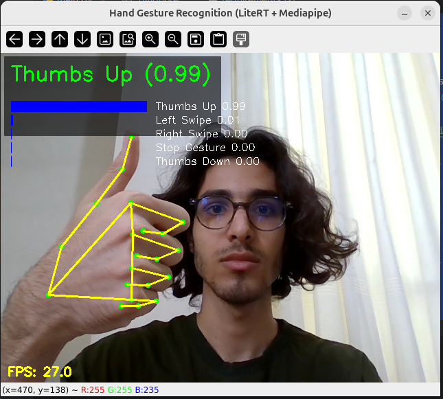
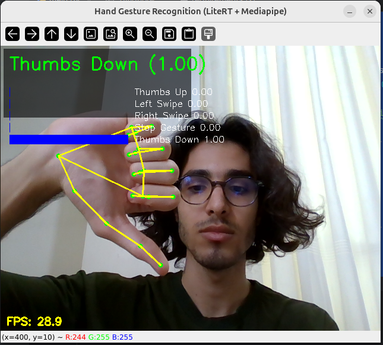
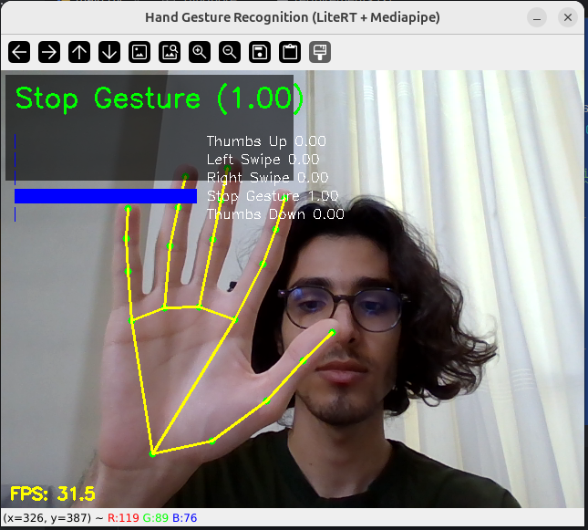
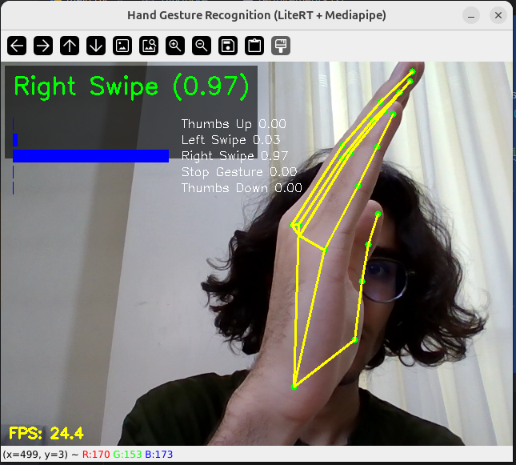
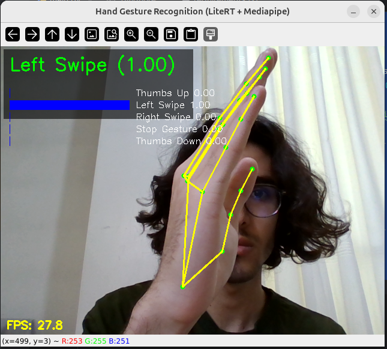

# Hand Gesture Recognition → (A) VLC Controller, (B) Raspberry Pi LED Controller

Lightweight, real-time hand-gesture recognition built on **MediaPipe Hands** landmarks and small **TF/Keras** models (LSTM/GRU/RNN/MLP).
Two practical runtimes are included:

1. **VLC media control** on desktop Linux (DBus/MPRIS with `playerctl` fallback)
2. **Raspberry Pi 3 GPIO** control (5 LEDs mapped to gestures)

---

## ✨ Key Features

* **Landmark-only pipeline** (no heavy CNN): 21 hand keypoints × (x,y,z) → 63-D per frame → **temporal window = 30 frames**.
* **Multiple models compared** (LSTM, GRU, SimpleRNN, MLP) with early stopping; auto-selects best by `val_accuracy`.
* **Clear metrics & visuals**: confusion matrices, learning curves, class balance plots, image size histograms, random samples.
* **TFLite export** for edge/runtime use.
* **Two ready-to-run apps**:

  * **VLC Controller**: Play/Pause, ±10s seek, volume ±5% using gestures.
  * **Raspberry Pi LEDs**: Debounced, exclusive LED control per gesture.

---

## 🗂️ Dataset Assumptions

Set `path` so that your data looks like:

```
{path}/
  train/train/  # folders per sample sequence (images)
  val/val/
```

Class grouping is handled by **name patterns**:

* Thumbs Up → `["Thumbs Up_new", "Thumbs_Up_new"]`
* Left Swipe → `["Left Swipe_new_Left Swipe_new", "Left_Swipe_new"]`
* Right Swipe → `["Right Swipe_new", "Right_Swipe_new"]`
* Stop Gesture → `["Stop_new", "Stop Gesture_new"]`
* Thumbs Down → `["Thumbs Down_new", "Thumbs_Down_new"]`

> Each sequence folder contains frames (`.jpg`/`.png`). The code slides a 30-frame window to create training sequences.

---

## 📦 Environment

Common (Colab / Desktop):

* Python 3.10+
* `tensorflow` (2.x), `mediapipe`, `opencv-python`, `numpy`, `matplotlib`, `seaborn`, `scikit-learn`

VLC Controller (Linux):

* `dbus-python` (preferred) and/or `playerctl` CLI (fallback)
* VLC running with MPRIS (default on most distros)

Raspberry Pi:

* Raspberry Pi OS (Bullseye/Bookworm)
* `RPi.GPIO`
* Camera (USB/CSI) accessible via OpenCV

---

## ⚙️ Installation (quick)

**Colab**

```bash
!pip install tensorflow mediapipe opencv-python scikit-learn seaborn
```

**Linux desktop**

```bash
python -m venv .venv && source .venv/bin/activate
pip install tensorflow mediapipe opencv-python scikit-learn matplotlib seaborn dbus-python
# (optional fallback) sudo apt install playerctl
```

**Raspberry Pi**

```bash
python3 -m venv .venv && source .venv/bin/activate
pip install tensorflow-lite==2.* mediapipe opencv-python scikit-learn matplotlib
pip install RPi.GPIO
```

> If full TensorFlow is heavy on Pi, keep it only for training/export; the **runtime uses TFLite**.

---

## 🧠 Training & Evaluation (Colab-friendly)

1. **Exploration**: class/frame counts, random samples, image size histograms, imbalance ratio.
2. **Feature extraction**: MediaPipe Hands → 63-D per frame; **sequence length = 30**.
3. **Models**: LSTM/GRU/RNN/MLP (with Dropout), early stopping on `val_loss`.
4. **Reports**: `classification_report`, **confusion matrices**, **val_accuracy** curves.
5. **Model selection & export**:

   * Saves best Keras model as `{NAME}_best_model2.h5`
   * Converts to **TFLite** `{NAME}_best_model2.tflite`

**Notes**

* Labels: `["Thumbs Up","Left Swipe","Right Swipe","Stop Gesture","Thumbs Down"]`
* You’ll see per-model confusion matrices and curves.
* Class imbalance is computed and printed.

---

## 📤 TFLite Export

The notebook converts the selected best model:

```python
converter = tf.lite.TFLiteConverter.from_keras_model(best_model)
tflite_model = converter.convert()
open(f"{best_model_name}_best_model2.tflite","wb").write(tflite_model)
```

(Colab snippet also copies artifacts to Google Drive.)

---

## ▶️ Runtime A: VLC Controller (Desktop Linux)

**Files of interest**: the block that imports `ai_edge_litert.interpreter.Interpreter` (TFLite) and defines `VLCController`.

**How it works**

* Captures webcam, runs MediaPipe’s **HandLandmarker** (`hand_landmarker.task`) to get landmarks.
* Maintains a rolling deque of 30 frames, runs TFLite model, and **debounces** actions.
* Prefers **DBus/MPRIS**; falls back to `playerctl`.

**Gesture → Action**

* **Stop Gesture** → Play/Pause
* **Thumbs Up** → Volume +5%
* **Thumbs Down** → Volume −5%
* **Right Swipe** → Seek +10s
* **Left Swipe** → Seek −10s

**Key thresholds**

* `CONF_THRESH = 0.75` (only trigger above this)
* `COOLDOWN_SEC = 1.0` (min time between actions)

**Run**

```bash
python vlc_controller.py \
  --model /path/to/LSTM_best_model2.tflite \
  --hand_model /path/to/hand_landmarker.task
```

> Ensure VLC is running. If DBus isn’t available, install `playerctl` and the script will auto-fallback.

---

## ▶️ Runtime B: Raspberry Pi LED Controller

**Files of interest**: the block that imports `RPi.GPIO` and uses `tensorflow.lite.Interpreter` (or `tflite_runtime` fallback).

**BCM Pin Mapping**

* `"thumbs up"` → **GPIO 17**
* `"thumbs down"` → **GPIO 27**
* `"left swipe"` → **GPIO 22**
* `"right swipe"` → **GPIO 23**
* `"stop/resume"` → **GPIO 24**

**Behavior**

* Only one LED is ON at a time (exclusive), except `stop/resume` toggles its own LED state.
* Debounce:

  * `PRED_THRESHOLD = 0.70`
  * `DEBOUNCE_SEC = 0.8`
  * `TOGGLE_DEBOUNCE_SEC = 1.2` (for `stop/resume`)
* Robust **label normalization** accommodates minor name variations.

**Run on Pi**

```bash
python rpi_leds.py \
  --model /home/pi/models/LSTM_best_model2.tflite \
  --hand_model /home/pi/models/hand_landmarker.task
```

> Requires a camera accessible via OpenCV. Script cleans up GPIO on exit.

---





## 📁 Assets you must provide

* **`hand_landmarker.task`** (MediaPipe Hand Landmarker). Place it where your script expects:

  * Desktop example: `/home/amir/Downloads/hand_landmarker.task`
  * Pi example: `/home/pi/models/hand_landmarker.task`
* **Your TFLite model** produced by training, e.g. `LSTM_best_model2.tflite`.

*(Do not rename labels or change `SEQUENCE_LENGTH` unless you retrain.)*

---

## 🧪 Tips & Troubleshooting

* **Low FPS?** Reduce webcam resolution, ensure single-hand mode (`num_hands=1`), keep `SEQUENCE_LENGTH=30`.
* **Actions firing too often?** Increase `COOLDOWN_SEC` (VLC) or `DEBOUNCE_SEC` (Pi), or raise `CONF_THRESH/PRED_THRESHOLD`.
* **VLC not responding?**

  * Make sure VLC is running.
  * Install `dbus-python` or `playerctl`.
  * Some sandboxed environments block DBus; try the fallback.
* **GPIO permissions**: run as a user with GPIO access (usually `pi`), not with `sudo` unless required by your setup.
* **Class imbalance**: consider sampling strategies or weighting if your dataset is skewed.

---

## 🔒 Safety

* On the Pi, **double-check wiring** and current limits; use resistors for LEDs.
* Avoid distracted gestures near machinery—VLC seeking is harmless, but the habit matters.

---

## 📜 License

Add your preferred license (e.g., MIT) and attribution if you redistribute the MediaPipe task file.

---

## ✅ At-a-Glance Defaults

* `SEQUENCE_LENGTH`: **30**
* Classes: **Thumbs Up / Left Swipe / Right Swipe / Stop Gesture / Thumbs Down**
* Best model auto-saved to: `"{best_model_name}_best_model2.h5"` and `".tflite"`
* **VLC thresholds**: `CONF_THRESH=0.75`, `COOLDOWN_SEC=1.0`
* **Pi thresholds**: `PRED_THRESHOLD=0.70`, `DEBOUNCE_SEC=0.8`, `TOGGLE_DEBOUNCE_SEC=1.2`
* **Pins (BCM)**: 17, 27, 22, 23, 24

---

If you want, I can tailor this README to your exact repo structure (file names, CLI flags) or add quickstart bash scripts.
